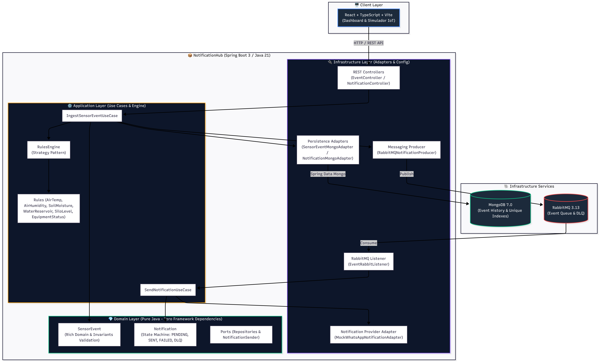
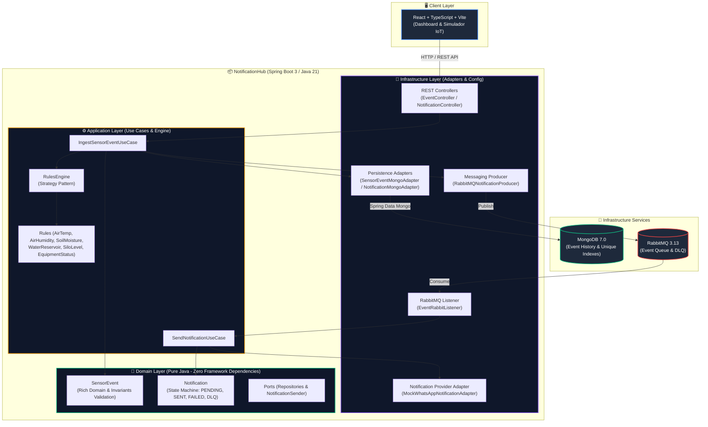

# 🌾 NotificationHub — Central de Notificações para Fazenda Inteligente

> **MVP de Monitoramento IoT, Motor de Regras e Notificações Assíncronas**  
> Desenvolvido para o Processo Seletivo do **Cogito Lab**.

---

## 📌 1. Visão Geral e Cenário de Negócio

O **NotificationHub** é uma solução distribuída voltada para o monitoramento contínuo de sensores de uma propriedade rural (**Fazenda Boa Esperança**, identificador `farm-001`, produtor **João Silva**).

A aplicação ingere dados de sensores IoT (temperatura, umidade do ar, umidade do solo, níveis de reservatório de água e silo, e estado de funcionamento de equipamentos), aplica regras de negócio automatizadas e dispara notificações assíncronas de atenção ou emergência para o produtor rural via serviços de mensageria.

---

## 🏗️ 2. Arquitetura e Decisões Técnicas

O projeto segue estritamente os princípios de **Clean Architecture (Hexagonal)**, **SOLID** e **Rich Domain Modeling**:





### 💡 Principais Pilares da Avaliação

1. **Resiliência e Mensageria Assíncrona (RabbitMQ + DLQ):**
   - Ingestão desassociada da notificação. Notificações que falham em múltiplos disparos são encaminhadas para uma **Dead Letter Queue (DLQ)** (`iot.notifications.dlq`), evitando perda de mensagens e travamentos na fila principal.

2. **Idempotência e Prevenção de Duplicidades (`eventId`):**
   - Sensores IoT retransmitem pacotes por perda de ACK. O sistema previne notificações duplicadas através de uma garantia em duas camadas:
     - *Camada de Aplicação:* Verificação rápida via `existsByEventId`.
     - *Camada de Persistência:* Índice único no MongoDB (`@Indexed(unique = true)`). Cenários de concorrência paralela resultam em `DuplicateEventException` (HTTP 409 Conflict).

3. **Validação Estruturada e Invariantes no Domínio:**
   - Eventos inválidos (ex: `AIR_HUMIDITY` de 130% ou `eventId` em branco) são rejeitados no construtor da entidade de domínio `SensorEvent` e tratados centralizadamente pelo `GlobalExceptionHandler` (HTTP 400 Bad Request).

4. **Motor de Regras Extensível (Strategy Pattern):**
   - Cada regra de sensor (`AIR_TEMPERATURE`, `AIR_HUMIDITY`, `SOIL_MOISTURE`, `WATER_RESERVOIR_LEVEL`, `SILO_LEVEL`, `EQUIPMENT_STATUS`) é uma classe isolada que implementa a interface `NotificationRule`, respeitando o princípio **Open/Closed (OCP)**.

---

## 🛠️ 3. Stack Tecnológica

- **Backend:** Java 21, Spring Boot 3.3.2, Spring Data MongoDB, Spring AMQP / RabbitMQ.
- **Frontend:** React 18, TypeScript, Vite, Lucide Icons, Vanilla CSS (Glassmorphic Design).
- **Persistência & Mensageria:** MongoDB 7.0, RabbitMQ 3.13 (com Management Plugin).
- **Testes Automatizados:** JUnit 5, Mockito.
- **Containerização:** Docker & Docker Compose.

---

## ⚡ 4. Instruções de Execução

### Pré-requisitos
- **Java 21** e **Maven 3.8+**
- **Node.js v20+** e **npm**
- **Docker** e **Docker Compose**

### Passo 1: Subir Infraestrutura (MongoDB e RabbitMQ)
Na raiz do repositório, execute:
```bash
docker compose up -d
```
> Isso iniciará o MongoDB na porta `27017` e o RabbitMQ na porta `5672` (Painel de Gestão RabbitMQ na porta `15672`).

### Passo 2: Executar o Backend (Spring Boot)
Na raiz do repositório, execute:
```bash
mvn spring-boot:run
```
A API REST estará rodando em: `http://localhost:8080`

### Passo 3: Executar o Frontend (React + Vite)
Em um novo terminal, entre na pasta `frontend`:
```bash
cd frontend
npm install
npm run dev
```
Abra o navegador em: `http://localhost:5173`

---

## 🧪 5. Execução de Testes Automatizados

Para rodar a suíte de testes unitários da aplicação:
```bash
mvn test
```

---

## 📑 6. Endpoints da API REST & Swagger UI

### 📌 Documentação Interativa (Swagger UI)
Com a aplicação rodando, acesse no seu navegador:
- **Swagger UI:** [http://localhost:8080/swagger-ui.html](http://localhost:8080/swagger-ui.html)
- **OpenAPI 3 JSON Spec:** [http://localhost:8080/v3/api-docs](http://localhost:8080/v3/api-docs)

### 🚀 Tabela de Endpoints

| Método | Endpoint | Descrição |
| :--- | :--- | :--- |
| `POST` | `/api/v1/events` | Ingestão individual de evento de sensor |
| `POST` | `/api/v1/events/batch` | Ingestão em lote de eventos (Simulador do Edital) |
| `GET` | `/api/v1/events` | Consulta o histórico de todos os eventos recebidos |
| `GET` | `/api/v1/events/{eventId}` | Detalhes de um evento por `eventId` |
| `GET` | `/api/v1/notifications` | Lista todas as notificações geradas e status |
| `GET` | `/api/v1/notifications/{id}` | Detalhes de uma notificação específica |

### Exemplo de Payload de Ingestão (`POST /api/v1/events`)
```json
{
  "eventId": "event-001",
  "farmId": "farm-001",
  "deviceId": "sensor-temp-01",
  "type": "AIR_TEMPERATURE",
  "value": 38.5,
  "unit": "C",
  "timestamp": "2026-08-17T14:30:00-03:00"
}
```

---

## 📜 7. Registro do Processo de Desenvolvimento

O histórico detalhado do uso de IA generativa (prompts, decisões tomadas e revisões técnicas) encontra-se no arquivo:
📄 **[DEVELOPMENT_LOG.md](DEVELOPMENT_LOG.md)**

---

## 📄 Licença
Este projeto é parte do processo seletivo do **Cogito Lab** e está sob a licença MIT.